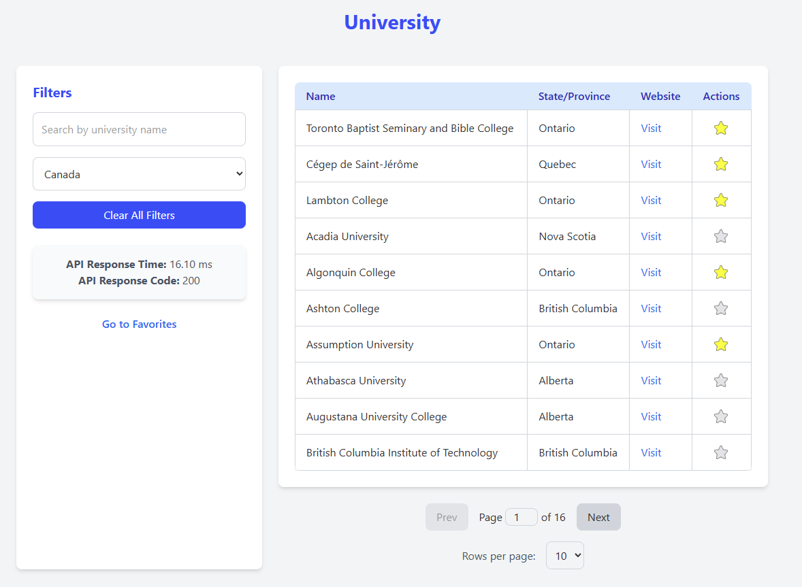
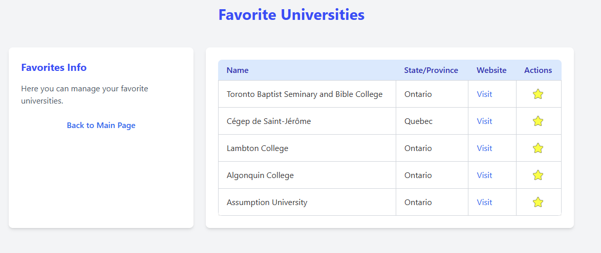
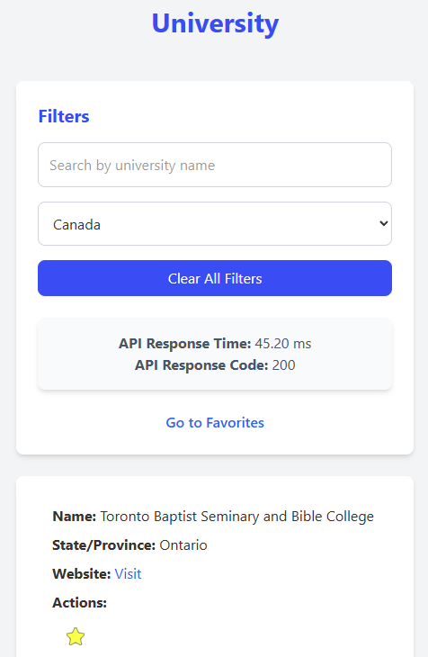

# University Data App

The **University Data App** is a web application built with Next.js that allows users to search for universities, and manage their favorite universities. The app is connected to a MongoDB database and provides a responsive and user-friendly interface.

---

## Features

- **Search Universities**: Search for universities by name and country.
- **Manage Favorites**: Add or remove universities from your favorites list.
- **Pagination**: Navigate through large datasets with pagination.
- **Responsive Design**: Optimized for both desktop and mobile devices.

---

## Technologies Used

- **Frontend**: React, Next.js, TypeScript, Tailwind CSS
- **Backend**: Next.js API routes
- **Database**: MongoDB
- **State Management**: React hooks (`useState`, `useEffect`, `useCallback`)
- **Styling**: Tailwind CSS for responsive and modern UI
- **Utilities**: Debouncing for search optimization

---

## Project Structure

```
src/
├── components/          # Reusable UI components (e.g., UniversityTable, Pagination)
├── container/           # Main pages (e.g., MainPage, FavoritesPage)
├── pages/               # Next.js pages (_app.tsx, index.tsx, API routes)
├── styles/              # Global CSS styles
├── utils/               # Utility functions and types
```

---

## Getting Started

### Prerequisites

- **Node.js** (version 14 or later)
- **npm** (Node package manager)
- **MongoDB** (running locally or accessible remotely)

---

### Installation

Install the dependencies:

```bash
npm install
```

---

### Setting Up the Database

1. Ensure MongoDB is running locally or accessible remotely. If MongoDB is not running, start it:

   ```bash
   mongod
   ```

2. Create a `.env` file in the root of the project and add the following environment variables:

   ```env
   MONGODB_URI=mongodb://localhost:27017
   MONGODB_DB_NAME=universityDB
   MONGODB_COLLECTION=universities
   ```

3. Seed the database using `seed.ts`:
   - The `seed.ts` script is located in the `src/utils` directory and is used to populate the database with initial data.
   - To run the script, use the following commands:
     ```bash
     npm run preseed
     npm run seed
     ```
   - This will populate the `universityDB` database in the `universities` collection with sample data.

---

### Running the Application

1. Start the development server:

   ```bash
   npm run dev
   ```

2. Open your browser and navigate to:

   ```
   http://localhost:3000
   ```

---

### Building for Production

To create an optimized production build, run:

```bash
npm run build
```

Then, you can start the production server with:

```bash
npm start
```

---

### API Endpoints

The app interacts with the following API endpoints:

- **Fetch Universities**: `/api/main?country={country}&search={search}&page={page}&limit={limit}`
- **Toggle Favorite**: `/api/main` (POST)
- **Fetch Favorites**: `/api/main?type=favorites`

---

### How to Use

1. **Search for Universities**:
   

   - Use the search bar to find universities by name.
   - Filter results by selecting a country from the dropdown.

2. **Manage Favorites**:
   

   - Click the star icon to add or remove universities from your favorites list.
   - Navigate to the "Favorites" page to view your saved universities.

3. **Responsive Design**:

   

---

### Docker Instructions (Optional)

To run the application using Docker, follow these steps:

1. Build the Docker image:

   ```bash
   docker build -t university-data-app .
   ```

2. Run the Docker container:

   ```bash
   docker run -p 3000:3000 university-data-app
   ```

3. Access the application at:

   ```
   http://localhost:3000
   ```

---

## Contributing

Feel free to submit issues or pull requests for any improvements or bug fixes.

---

## License

This project is licensed under the MIT License.
